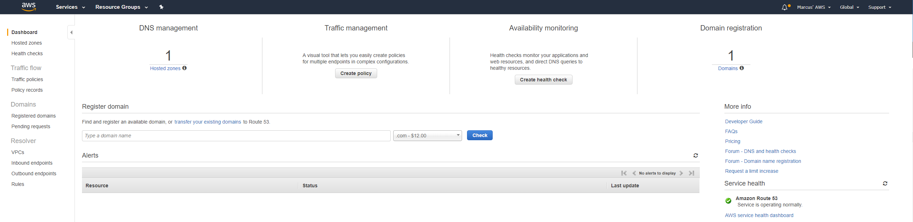

# Setting up a Static Website Using a Custom Domain 


Suppose that you want to host your static website on Amazon S3. You registered a domain (for exampled my domain.com), and you want requests to be served from your Amazon S3 content. Whether you have an existing static website that you want to host on Amazon S3, or you are starting from the beginning, use this example to learn how to host websites on Amazon S3. We will be using GitHub to upload our code. From there we will link our your Travis CI account to automate the push to Amazon S3.

*Note that you still do this without a custom domain. 

Why S3? S3 is a great tool on AWS where not only is it being used for storage, but hosting static sites. With static sites people can host websites to present their portfolio, blogs, anything they want. Since it is inexpensive and an amazing tool. 

## Before you Begin

As you follow the steps in this example, you will work with the following services:

**Amazon Route 53** - You use Route 53 to register domains and to define where you want to route internet traffic for your domain. We will explain how to create your domain name and route traffic from your domain to an S3 Bucket. 

**Amazon S3** - You use Amazon S3 to create buckets, upload objects such as files and pictures to and configure them for people to see or host websites.

**GitHub** - Github is a code hosting platform for collaboration and version control. GitHub lets you and others work together on problems and work towards a common goal while learning from each other. 

**IAM** - Identity and access management is used to grant or deny access to users to keep applications secure.

**Linux** - Linux is a well known open source OS. Today, many devices run Linux. 

**Travis CI** - Travis CI is a hosted continuous integration service used to build and test software projects hosted at GitHub. 

# SSH Key Generation

To begin we need to get GitHub rolling, but before we can do that we need to create SSH keys.

From a terminal screen we can generate a ssh key of type -t rsa and length (-b) 2048.

```
ssh-keygen-t rsa -b 2048
```


The above command would produce two files:
 + github_key
 + github_key.pub

Let's check to see if the keys are there by running the following:

```
ls -la .ssh/
```


# Configuring GitHub

We need to associate our newly generated key to be used for Github connections. I learned from a wise man (no pun intended) that by doing this we can separate ssh keys between many sites.

```
vim .ssh/config
Host github.com
    HostName github.com
    IdentityFile ~/.ssh/github_key
```

To exit vim:

```
press   <esc>

type    :wq 
```

Time to copy your public key and link it to your GitHub. 

First, we need to copy your public key. 

.. warning:: Warning ``do not copy your private key`

```
cat .ssh/github_key.pub
```

Second, copy the output.

Lastly, got to [GitHub](https://github.com/) and create an account or login. Once that is done we will upload your keys. 

Click on the icon in the top right, then **Settings**. 

On the left hand side you should see **SSH keys**. Follow the prompts to enter your keys. 

## Setting up your Git Repository

First, we need to  test our SSH key with Github:

```
ssh -T git@github.com
```

If successful we need to make our directory. In your terminal make sure you are home by running the command:

```
cd
```

Next we will run the following:

```
mkdir aws_project
```

What we are doing is creating a directory called aws_project. 

Let's first change directories to our aws_project and then we will initialize the directory.

```
cd aws_project

git init
```

We will now need to configure our git config

```
git config --global user.email <youremailhere>
git config --global user.name <username>
git config --list
```

## Creating HTML file

We need to add an HTML file in your git so that users can see text on your website.

```
touch index.html
```

Touch will create a file within your aws_project called index.html

We now need to get into the html file we created so we can add code for our website.

```
vim index.html
```

Next, we need to copy and paste the code into your file.

```
<html xmlns="http://www.w3.org/1999/xhtml" >
<head>
    <title>My Website Home Page</title>
</head>
<body>
  <h1>Welcome to my website</h1>
  <p>Now hosted on Amazon S3!</p>
</body>
</html>
```

This reads that the Title of the page will read "My Website Home Page" and you will have a header that says " Welcome to my website". Underneath that it will say "Now hosted on Amazon S3!"

After, we have pasted the text into the file we need to save the file and quit by the following commands:

```
press   <esc>

type    :wq 
```


## Initial Push to Github

Now lets, do our initial push to Github.

```
git add .
```

What we are doing is adding everything in our directory to get ready to be pushed.

After, we will run:

```
git commit -m "initial push"
```
We have just moved the files to being committed. We use the "-m" to add a commit message.

We will now need to add the remote repository (Github) and sync the folder you've created on your local disk (origin) to the remote master by the following:

```
git push -u git@github.com:<yourusername>/aws_project.git master
```

If successful, you should be able to login into your Github and see your project and your html file that you created within that project. 

# AWS
So lets begin,

First, let's login into your [AWS account](https://aws.amazon.com) or create one [here](https://portal.aws.amazon.com/billing/signup?nc2=h_ct&src=default&redirect_url=https%3A%2F%2Faws.amazon.com%2Fregistration-confirmation#/start).

## Register a Domain

We first need to click on **Route 53** in under the **Services** tab. 


Now, that you are in the Route 53 dashboard you will see a header called **Register domain**. Enter the domain name you wish to have. For extra money you can choose different endings and click **Check** to see if it is available. 

If available you will add to cart and follow the prompts to purchase the domain name. 

## S3

First we will create two new S3 buckets.

The two buckets we will create have to match your domain name that you purchased. For example, if your domain name is example.com then your buckets will be: 

* example.com
* www.example.com

### So how do I create an S3 Bucket?

Once logged into AWS console we will click on the **Services** tab and click on **S3**.

Next, we will click **Create Bucket**. 


On the bucket **Name and region page**, type the name of your domain name and click **Create**.

We will follow the same step as above but we will be creating another one for your subdomain.

Lets now upload the **index.html** file into the S3 bucket called **example.com**. 

You will host your content out of the root domain bucket (example.com), and you will redirect requests for "www.example.com" to the root domain bucket. You can store content in either bucket. For this example, you host content in the "example.com" bucket. The content can be text files, photos, videos—whatever you want. 

### Upload HTML file to bucket

For this example, we will upload the file **index.html** file we created in our aws_project. We will do this now to make sure that when we complete the the AWS portion that we can see our website. 

Go to the **AWS S3 console**.

Click on **example.com** bucket. 

Click on **Upload**.

Add the **index.html** file.

Click **Upload**.

### Configure Buckets for Website Hosting

To host a website, your bucket must have public read access and also must be configured to host a website. It is intentional that everyone in the world will have read access to this bucket. To grant public read access, attach the following bucket policy to the example.com bucket, substituting the name of your bucket for example.com.

```
{
   "Version":"2012-10-17",
   "Statement":[
      {
         "Sid":"PublicReadGetObject",
         "Effect":"Allow",
         "Principal":"*",
         "Action":[
            "s3:GetObject"
         ],
         "Resource":[
            "arn:aws:s3:::example.com/*"
         ]
      }
   ]
}
```

To attach the policy click on the **example.com** bucket and then click on the tab labeled **Permissions**. 

Within that tab you will see **Bucket Policy** where you will attach the above policy. 

#### Setting up Static Website Hosting

In the **Bucket name** list, choose the name of the bucket that you want to enable static website hosting for. In this example, we will be using the **example.com** bucket.

Choose **Properties**.

Choose **Static website hosting**


Configure the **example.com** bucket for website hosting. In the **Index Document** box, type the name that you gave your index page. This is the name we created in our aws_project which should be **index.html**. 

Click **Save**.

#### Configure Your Website Redirect 

Now that you have configured your bucket for website hosting, we need to configure the **www.example.com** bucket to redirect all requests for "www.example.com" to "example.com".

In the Amazon S3 console choose the **www.example.com** bucket.

Choose **Properties**.

Choose **Static website hosting**.

Choose **Redirect requests**. In the **Target bucket or domain** box, type example.com.


Click **Save**.

#### Add Alias Records for example.com and www.example.com

In this step, you create the alias records that you add to the hosted zone for your domain maps example.com and www.example.com to the corresponding S3 buckets. Instead of using IP addresses, the alias records use the Amazon S3 website endpoints. Amazon Route 53 maintains a mapping between the alias records and the IP addresses where the Amazon S3 buckets reside.

Open the [Route 53 console](https://console.aws.amazon.com/route53/).



In the list of **hosted zones**, choose the name of your domain.

Choose **Create Record Set**.

Specify the following values:

**Name**

For the first record that you'll create, accept the default value, which is the name of your hosted zone and your domain. This will route internet traffic to the bucket that has the same name as your domain.

Repeat this step to create a second record for your subdomain. For the second record, type www. This will route internet traffic to the www.example.com bucket.

**Type**

Choose **A – IPv4 address**.

**Alias**

Choose **Yes**.

**Alias Target**

Type the name of your Amazon S3 bucket endpoint, for example example.com (s3-website-us-east-1).

**Note**

You specify the same value for Alias Target for both records. Route 53 figures out which bucket to route traffic to based on the name of the record.

**Routing Policy**

Accept the default value of **Simple**.

**Evaluate Target Health**

Accept the default value of **No**.

Choose **Create**.

For www.example.com, repeat steps 3 through 5 to create a record.


If done correctly, you should be able to type the your domain name into your browser and you should see your website.

### IAM

We need to create an IAM user for Travis CI to use and deploy our code into S3. 

Go to AWS console.

Click on the **Services** tab. 

Click on **IAM**.

Click on **Users**. It will be on the left hand side.

At the top of the page will be **Add User**. We will click on that.

**Username** will be "Travis_CI".

Check the  box that says **Programmatic access**. 

Click on **Permissions**.

Underneath **Add user to group** you will see **Create Policy**. We will be creating a new policy. This will open another tab to create the policy. **Do not close the other tab!**

Click on the **JSON** tab. 

Delete the text already inside that box. We will be copying and pasting the following text within the box. The following text will allow Travis CI access to our S3 bucket, allow it to List, Read, and Write in our S3 bucket. You will replace example.com with your buckets name.  

```
{
    "Version": "2012-10-17",
    "Statement": [
        {
            "Effect": "Allow",
            "Action": "s3:ListAllMyBuckets",
            "Resource": "arn:aws:s3:::*"
        },
        {
            "Effect": "Allow",
            "Action": [
                "s3:ListBucket",
                "s3:GetBucketLocation"
            ],
            "Resource": [
                "arn:aws:s3:::example.com"
            ]
        },
        {
            "Effect": "Allow",
            "Action": [
                "s3:PutObject",
                "s3:GetObject",
                "s3:GetObjectAcl",
                "s3:DeleteObject",
                "s3:PutObjectAcl"
            ],
            "Resource": [
                "arn:aws:s3:::example.com/*"
            ]
        }
    ]
}
```

Name your policy **Travis_CI_Policy** and click on **Create Policy**.

Go back to the previous tab and click on the **refresh** symbol. 

Type in the search bar **Travis_CI_Policy**. 

Click on the checkbox next to it.

Skip **Tags** and move on to **Review**. 

Click on **Create User**.

**This next step is very important, because we only get one shot to see the secret access key.**

There are a few ways we can do this. One of them being downloading the **.csv** file. You can copy the keys to a notepad or text file or simply use a pencil and scratch piece of paper to write them down.

For this example I will download the **.csv** file since that is the easiest. 

We will input these keys for the future when we get into Travis CI. 

Congrats, you've made it this far, but let's take it one step further and have Travis CI make the push from GitHub to our S3 bucket.

# Travis CI

To begin we need to create an account on [Travis CI](https://travis-ci.org/). Your account will be linked with your GitHub. 

## Active Repository

Once the accounts are linked then we will need to active the repository. We can do this by the following:

Click on the icon in the top left. 

Underneath **MY ACCOUNT** click on **Sync account**. 

Towards the middle of the page you should see the repository that we created. There will be a slider to the right of the repository that we need to click on to active our repository. 

Once that is completed you should be able to see your **branches**. 


## travis.yml

Lets head back to our terminal to create an empty .travis.yml file within your repo folder.

Open terminal

```
cd aws_project

touch .travis.yml
```
We will now vim into the new file and paste the following: 

```
vim .travis.yml

language: node_js
node_js:
  - node
deploy:
  provider: s3
  access_key_id: $AWS_ACCESS_KEY_ID
  secret_access_key: $AWS_SECRET_ACCESS_KEY
  bucket: example.com
  acl: public_read
```

What we are pasting is that we want Travis CI to run this in node because by default Travis runs in ruby. We would run into an error where ruby is looking for a "rake" file that we don't have. We then want to deploy our index.html into S3 using the keys we downloaded. We have to specify which bucket we are putting our HTML file in. By setting the acl to public read allows for public reading access. 


## package.json

Because we are running node we need to create another file within our aws_project. 

```
cd aws_project

touch package.json
```

Within package.json file we will paste the following:

```
{
  "name": "your-package",
  "version": "0.0.1",
  "description": "My very first package",
  "main": "index.js",
  "scripts": {
    "test": "echo \"No tests\" && exit 0"
  },
  "repository": {
    "type": "git",
    "url": "git+https://github.com/user/aws_project.git"
  },
  "author": "your name",
  "license": "MIT"
}
```

**You need to replace user with the username you use on Github**.


## Environment Keys

Lets jump back in to Travis CI and add our environment keys.

Login into Travis CI

Click on **Dashboard** at the top of the page. 

To the right of your project you will see three lines. Click on that and click on **Settings**.

Underneath the **Environment Variables** we will add our keys.

The first variable will be:

```
Name: AWS_ACCESS_KEY_ID

Value: will be your access key in your .csv file

Branch: Master
```

The second variable will be
```
Name: AWS_SECRET_ACCESS_KEY

Value: will be your secret access key in your .csv file

Branch: Master
```


## Prep for Final Push

Let's jump back into our terminal and open up our index.html file.

```
vim aws_project/index.html
```

Let's add some text into our HTML file to see a change at our website.


```
<html xmlns="http://www.w3.org/1999/xhtml" >
<head>
    <title>My Website Home Page</title>
</head>
<body>
  <h1>Welcome to my website</h1>
  <p>Now hosted on Amazon S3!</p>

  <h2>About Me</h2>
  <p>My name is <insertname> and I live in <City,State>!
</body>
</html>
```

Let's save!

``` 
press   <esc>

type    :wq 
```


## Final Push

Once that is done we will attempt our first push to our S3 from just our terminal. 

``` 
git add .
```

We want to add all the files we just created.

Next, we will commit the files with:

```
git commit -m "new files"
```

Finally, we will do our git push with:

```
git push
```

We should be able to see the change in Github. We can also login into Travis CI and watch Travis copying the file from Github to S3. Once that is successful we should check our S3 buckets to see the files have been added and if we go to our website we can see the that the new file has been uploaded to S3.

# Conclusion 

Congrats, you have officially created an S3 bucket that is linked with your domain you registered using Route 53. You created a user for Travis CI to upload the file to your S3 bucket when it sees the change you created in your Github master branch. 

